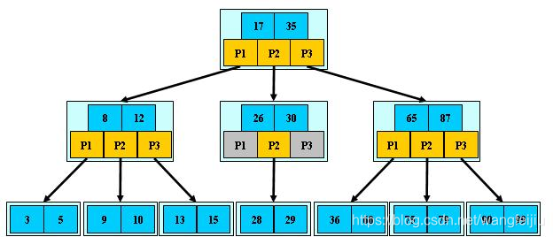
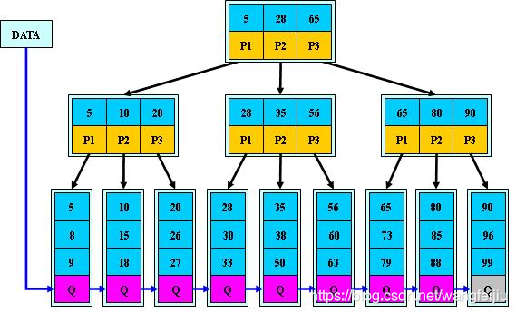
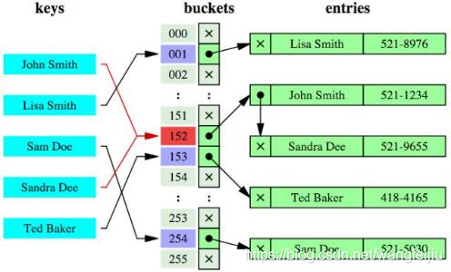

# 索引

## 索引概述

索引是对数据库表中一列或多列的值进行排序的一种结构。MySQL索引的建立对于MySQL的高效运行是很重要的，索引可以大大提高MySQL的检索速度。索引只是提高效率的一个因素，如果你的MySQL有大数据量的表，就需要花时间研究建立最优秀的索引，或优化查询语句。

📌简单类比：数据库如同书籍，索引如同书籍目录，假如我们需要从书籍查找与 xx 相关的内容，我们可以直接从目录中查找，定位到 xx 内容所在页面，如果目录中没有 xx 相关字符或者没有设置目录（索引），那只能逐字逐页阅读文本查找，效率可想而知。

## 索引的优缺点

索引可以大大提高MySQL的检索速度，为什么不对表中的每一个列创建一个索引呢？

### 优点

- 索引大大减小了服务器需要扫描的数据量，从而大大加快数据的检索速度，这也是创建索引的最主要的原因。
- 索引可以帮助服务器避免排序和创建临时表。
- 索引可以将随机IO变成顺序IO。
- 索引对于InnoDB（对索引支持行级锁）非常重要，因为它可以让查询锁更少的元组，提高了表访问并发性。
- 关于InnoDB、索引和锁：InnoDB在二级索引上使用共享锁（读锁），但访问主键索引需要排他锁（写锁）。
- 通过创建唯一性索引，可以保证数据库表中每一行数据的唯一性。
- 可以加速表和表之间的连接，特别是在实现数据的参考完整性方面特别有意义。
- 在使用分组和排序子句进行数据检索时，同样可以显著减少查询中分组和排序的时间。
- 通过使用索引，可以在查询的过程中，使用优化隐藏器，提高系统的性能。

### 缺点

- 创建索引和维护索引要耗费时间，这种时间随着数据量的增加而增加。
- 索引需要占物理空间，除了数据表占用数据空间之外，每一个索引还要占用一定的物理空间，如果需要建立聚簇索引，那么需要占用的空间会更大。
- 对表中的数据进行增、删、改的时候，索引也要动态的维护，这就降低了整数的维护速度。
- 如果某个数据列包含许多重复的内容，为它建立索引就没有太大的实际效果。
对于非常小的表，大部分情况下简单的全表扫描更高效。
- 索引失效：某些情况下，索引可能无法被充分利用，比如对索引列进行函数操作或者数据类型不匹配等情况。这些都会导致数据库不得不进行全表扫描逐行检查，而不是使用索引。

## 创建索引的准则

索引是建立在数据库表中的某些列的上面。因此，在创建索引的时候，应该仔细考虑在哪些列上可以创建索引，在哪些列上不能创建索引。

### 应该创建索引的列

- 在经常需要搜索的列上，可以加快搜索的速度。
- 在作为主键的列上，强制该列的唯一性和组织表中数据的排列结构。
- 在经常用在连接（JOIN）的列上，这些列主要是一外键，可以加快连接的速度。
- 在经常需要根据范围（<，<=，=，>，>=，BETWEEN，IN）进行搜索的列上创建索引，因为索引已经排序，其指定的范围是连续的。
- 在经常需要排序（order by）的列上创建索引，因为索引已经排序，这样查询可以利用索引的排序，加快排序查询时间。
- 在经常使用在WHERE子句中的列上面创建索引，加快条件的判断速度。

### 不该创建索引的列

- 对于那些在查询中很少使用或者参考的列不应该创建索引。
- 若列很少使用到，因此有索引或者无索引，并不能提高查询速度。相反，由于增加了索引，反而降低了系统的维护速度和增大了空间需求。
- 对于那些只有很少数据值或者重复值多的列也不应该增加索引。
- 这些列的取值很少，例如人事表的性别列，在查询的结果中，结果集的数据行占了表中数据行的很大比例，即需要在表中搜索的数据行的比例很大。增加索引，并不能明显加快检索速度。
- 对于那些定义为text, image和bit数据类型的列不应该增加索引。这些列的数据量要么相当大，要么取值很少。
- 当该列修改性能要求远远高于检索性能时，不应该创建索引。（修改性能和检索性能是互相矛盾的）

## 索引结构

MySQL中常用的索引结构（索引底层的数据结构）有：B-TREE，B+TREE，HASH 等。

### B-TREE

B-树就是B树，多路搜索树，树高一层意味着多一次的磁盘I/O。下图是3阶B树。



B树的特征：

- 关键字集合分布在整颗树中；
- 任何一个关键字出现且只出现在一个结点中，每一个关键字都能对应一个指向单个数据行的指针；
- 搜索有可能在非叶子结点结束；
- 其搜索性能等价于在关键字全集内做一次二分查找；
- 自动层次控制；

### B+TREE

B+树是B-树的变体，也是一种多路搜索树。



B+树的特征：

- 所有关键字都出现在叶子结点的链表中（稠密索引），且链表中的关键字恰好是有序的；
- 不可能在非叶子结点命中，因为非叶子节点中没有指向数据行的指针；
- 非叶子结点相当于是叶子结点的索引（稀疏索引），叶子结点相当于是存储（关键字）数据的数据层；
- 每一个叶子节点都包含指向下一个叶子节点的指针，从而方便叶子节点的范围遍历。
- 更适合文件索引系统；

### HASH

哈希索引就是采用一定的哈希算法，把键值换算成新的哈希值，检索时不需要类似B+树那样从根节点到叶子节点逐级查找，只需一次哈希算法即可立刻定位到相应的位置，速度非常快。



Hash索引特点：

- Hash索引仅仅能满足"=",“IN"和“<>”查询，不能使用范围查询。
- 由于Hash索引比较的是键进行Hash运算之后的Hash值，所以它只能用于等值的过滤，不能用于基于范围的过滤。

## 索引分类

MySQL 的索引有两种分类方式：逻辑分类和物理分类。

### 逻辑分类

按功能划分：

- 主键索引：一张表只能有一个主键索引，不允许重复、不允许为 NULL。
- 唯一索引：数据列不允许重复，允许为 NULL 值，一张表可有多个唯一索引。
- 普通索引：一张表可以创建多个普通索引，允许数据重复，允许 NULL 值插入。
- 全文索引：它查找的是文本中的关键词，主要用于全文检索。

按列数划分：

- 单例索引：一个索引只包含一个列，一个表可以有多个单例索引。
- 组合索引：一个组合索引包含两个或两个以上的列。
  - 最左前缀原则
  组合索引的列是有顺序的，当创建组合索引时，索引列的顺序非常重要。MySQL 能够利用组合索引的 **最左前缀** 部分（即索引的最左边的列），即使查询条件没有涉及所有的索引列，也能部分使用索引。
  例如：

    ```sql
    CREATE INDEX idx_name_age_gender ON users (name, age, gender);
    ```

    这个组合索引包含 name, age, gender 三列。如果你查询时使用了 name 和 age，MySQL 依然能够利用这个组合索引来加速查询。如果查询只使用 name，也能利用该索引，但如果查询只使用 age 或 gender，则不能利用该组合索引。

## 物理分类

分为聚簇索引和非聚簇索引（有时也称辅助索引或二级索引）

聚簇是为了提高某个属性(或属性组)的查询速度，把这个或这些属性(称为聚簇码)上具有相同值的元组集中存放在连续的物理块。

聚簇索引（clustered index）不是单独的一种索引类型，而是一种数据存储方式。这种存储方式是依靠B+树来实现的，根据表的主键构造一棵B+树且B+树 ***叶子节点存放的都是表的行记录数据*** 时，方可称该主键索引为聚簇索引。聚簇索引也可理解为将数据存储与索引放到了一块，找到索引也就找到了数据。
特点：
· 数据行的物理存储顺序和索引顺序一致，因此每个表只能有一个聚集引。  
· 聚集索引对范围查询（例如 BETWEEN, >=, <）非常高效，因为数据经按照引顺序排列，数据库可以快速定位并读取所需的行。  
· 由于聚集索引中的数据直接存储在叶子节点，因此不需要额外的指针引用，空间利用率较高。  
· 插入、更新操作可能会引发数据行的重新排序或移动，导致开销较大尤其是在入的数据顺序与聚集索引的顺序不一致时。

非聚簇索引：数据和索引是分开的，B+树叶子节点存放的不是数据表的行记录，而是 **指向数据行的指针**。
特点：  
· 一个表可以有多个非聚集索引。
· 查询时先通过索引找到对应的数据指针，然后通过指针访问数据。
· 对于单列查找、等值查询，非聚集索引同样能提供很好的性能。但对范围查询，由于数据行不按索引顺序存储，可能需要额外的跳转或扫描操作。  
· 非聚集索引需要存储指针，因此会消耗更多的存储空间，尤其是当一表有多个非聚集索引时。
· 非聚集索引在数据插入、删除或更新时不需要对表中的数据行进行重排序，只需要维护索引本身。因此，更新操作的开销相对较低。

## 使用EXPLAIN 关键字检查索引是否生效

### EXPLAIN 执行计划的输出字段

总结：**简单来说就是在查询语句前使用EXPLAIN关键字，就会生成一个表，表中有一列是key，表示使用到的索引，还有很多列表示查询性能、是否能优化、如何优化等**

EXPLAIN 语句的结果通常包含以下字段：

- id
  - 代表查询中操作的序列号，包含数字的步骤将被依次执行。对于联合查询，id 不同的部分会按照 id 的值从大到小执行。
- select_type
  - 指出每个 SELECT 语句的类型，常见的有：
    - SIMPLE：简单查询，不包含子查询或联合查询。
    - PRIMARY：如果一个查询中包含子查询或联合查询，最外层的查询会标记为 PRIMARY。
    - SUBQUERY：子查询中的 SELECT。
    - DERIVED：派生表查询。派生表查询与子查询的区别主要在于，子查询生成的结果集通常是一个标量值、一行或多行数据，直接用于主查询的条件判断或计算，不会在最终结果中体现，例如:  `SELECT * FROM students WHERE age > (SELECT AVG(age) FROM students);
`
    其中的子查询 `(SELECT AVG(age) FROM students)` 返回一个标量值，该值用于主查询的 WHERE 子句中进行条件过滤。  
    但派生表在 FROM 子句中的子查询生成的结果集被视为一个临时表，并且可以像普通表一样在查询中使用，形如 `SELECT d.xxx FROM (SELECT ...) AS d`， 派生表 d 中的数据会直接体现在结果中。假设有以下查询：

    ```sql
    EXPLAIN SELECT d.student_id, d.avg_score
    FROM (SELECT student_id, AVG(score) AS avg_score FROM scores GROUP BY student_id) AS d
    WHERE d.avg_score > 75;
    ```

    这个查询首先生成一个派生表 d，它包含了每个学生的平均分数，然后对这些结果进行过滤。执行计划可能如下：

    id|select_type|table|type|possible_keys|key|key_len|ref|rows|Extra
    ---|---|---|---|---|---|---|---|---|---
    1|PRIMARY|`<derived2>`|ALL|NULL|NULL|NULL|NULL|5|Using where
    2|DERIVED|scores|ALL|NULL|NULL|NULL|NULL|20|Using temporary; Using filesort
    - UNION：联合查询的第二个或后续的 SELECT。
    - UNION RESULT：从 UNION 得到的结果集。
- table
  - 表示正在访问的表的名称。如果是子查询或派生表，则会显示 `<derivedX>`，其中 X 是派生表的序列号。
- partitions
  - 显示查询访问的分区（如果表分区了），否则为空。
- type
  - 表示 MySQL 在执行查询时如何访问表中的数据。不同的访问类型代表了不同的效率和处理方式。
    - system：表示要访问的表中只有一行数据。
    - const：表示要访问的表中最多只有一行匹配条件，通常用于主键或唯一索引的查询。
    - eq_ref：表示对要访问的表中的每行数据，都要从另一张表中读取一行数据。通常用于连接操作，其中一个表的列是另一个表的主键或唯一键。例如：`EXPLAIN SELECT * FROM orders JOIN customers ON orders.customer_id = customers.customer_id;`，customer_id 是 customers 表的主键、唯一索引，因此对要访问的 orders 表中的每一行，都会从 customers 表中读取且只能读取到一行数据。
    - ref：表示非唯一索引扫描，返回匹配某个单个值的所有行。例如：`EXPLAIN SELECT * FROM orders WHERE customer_id = 1234;`，在 orders 表中，customer_id 不是唯一索引，MySQL 会使用 ref 类型，查找所有与 customer_id = 1234 匹配的行。
    - range：表示检索特定范围内的行，使用索引。通常用于 BETWEEN、>, <, IN 等操作。
    - index：表示全索引扫描，MySQL 读取整个索引来满足查询需求。比 ALL 类型快，因为索引文件通常比数据文件小。
    - ALL：表示全表扫描，MySQL 需要读取整个表来查找匹配的行。
- possible_keys
  - 显示查询时可能会用到的索引，但不一定实际使用。
- key
  - 实际使用的索引。如果 key 为空，表示没有使用索引。
- key_len
  - 表示索引的长度（字节数），反映 MySQL 使用索引的字节数。长度越小，性能通常越好。
- ref
  - 显示查询的哪一列或常量与 key 索引一起被使用。
- rows
  - 估算了 MySQL 认为需要读取的行数。值越大，查询可能越慢。
- filtered
  - 反映了查询条件的选择性，即在所有扫描的行中，有多少比例的行满足查询条件。值的范围是 0 到 100，表示从没有行通过过滤条件（0%）到所有行都通过过滤条件（100%）。filtered 是 MySQL 优化器估算的值，不是实际的运行时结果。
- Extra
  - 包含额外信息，通常用来解释查询是否有优化空间。常见的值有：
    - Using index：查询中只使用索引字段，不需要访问表的记录。
    - Using where：索引被使用，但还需要在过滤后的数据上应用 WHERE 条件。
    - Using filesort：MySQL 需要对数据进行排序，这通常表示没有使用索引排序，可能会导致性能问题。
    - Using temporary：MySQL 需要使用临时表来存储结果集，这通常意味着有子查询或排序操作，可能导致性能下降。
