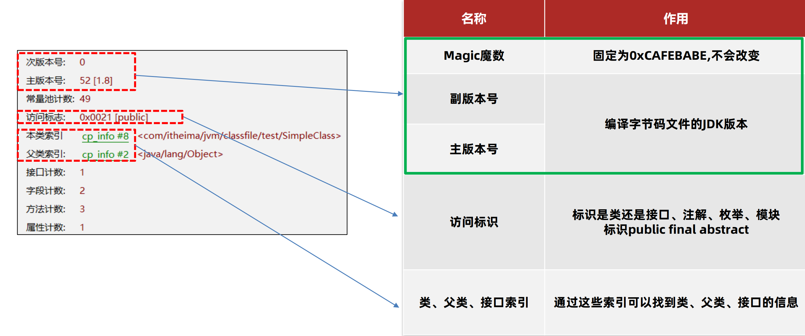
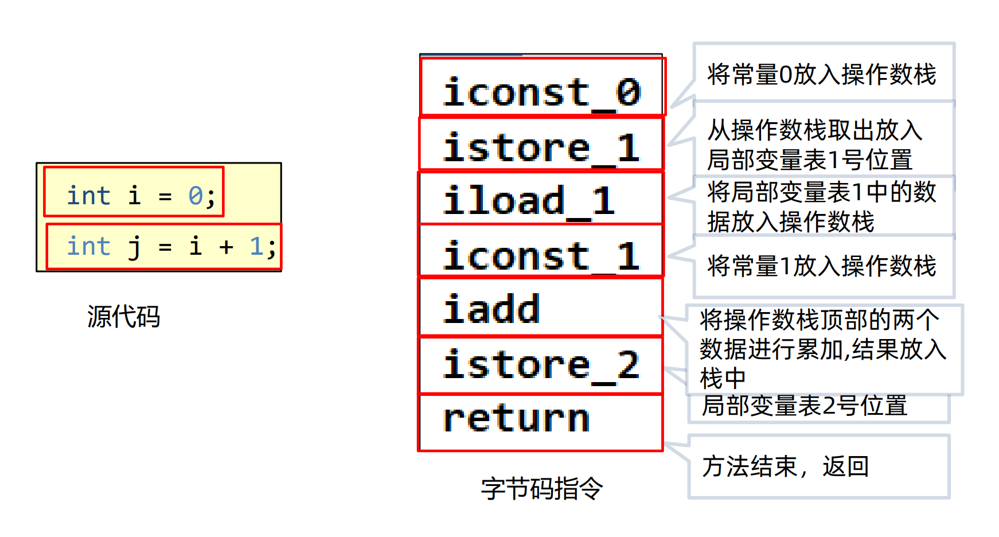
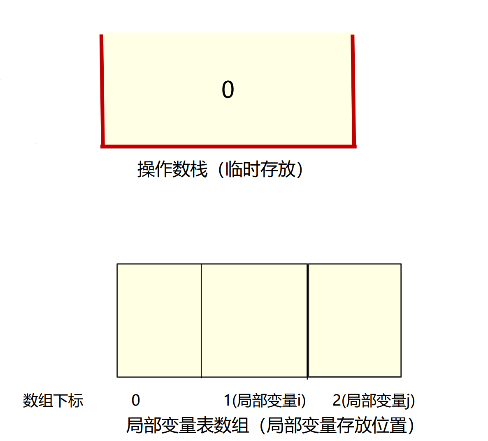

# Java虚拟机——JVM

## JVM概述

### 什么是JVM

JVM 全称是 Java Virtual Machine，中文译名 Java虚拟机。JVM 本质上是一个运行在计算机上的程序，他的职责是运行Java字节码文件。

### JVM的功能

1. 解释和运行
    - 对字节码文件中的指令，实时的解释成机器码，让计算机执行
2. 内存管理
    - 自动为对象、方法等分配内存
    - 自动的垃圾回收机制，回收不再使用的对象
3. 即时编译
    - 对热点代码进行优化，提升执行效率
    - Java语言如果不做任何优化，性能不如C、C++等直接运行机器码的语言

Java需要实时解释，不能一次性全部编译成可执行文件（机器码）后执行，因此性能会有所下降，Java的这种做法主要是为了支持跨平台特性。而即时编译正是为了优化这一问题。

#### 即时编译

JVM提供了即时编译 (Just-In-Time 简称JIT) 进行性能的优化，最终能达到接近C、C++语言的运行性能，甚至在特定场景下实现超越。

### JVM的设计规范

- 《Java虚拟机规范》由Oracle制定，内容主要包含了Java虚拟机在设计和实现时需要遵守的规范，主
要包含class字节码文件的定义、类和接口的加载和初始化、指令集等内容。
- 《Java虚拟机规范》是对虚拟机设计的要求，而不是对Java设计的要求，也就是说虚拟机可以运行在
其他的语言比如Groovy、Scala生成的class字节码文件之上。

### JVM的组成

## 字节码文件的组成

字节码文件中保存了源代码编译之后的内容，以二进制的方式存储，无法直接用记事本打开阅读。推荐使用jclasslib工具查看字节码文件。

### 基础信息

#### 魔数、字节码文件对应的Java版本号

- 魔数
  - 此处(Java字节码文件中)，魔数(magic number)指的是文件的头几个字节(文件头)，固定为`0xCAFEBABE`。
  - 文件是无法通过文件扩展名来确定文件类型的，文件扩展名可以随意修改，不影响文件的内容。
  - 软件使用文件头去校验文件的类型，如果软件不支持该种类型就会出错。
  - 在代码中，魔数有时也指那些没有明确含义的常量值，直接在代码中使用而没有给予解释或定义的数值。
- 字节码文件对应的Java版本号
  - 分为主版本号和次版本号，指的是编译字节码文件的JDK版本号。
  - 主版本号用以识别大版本号，次版本号用以区分同一大版本号的不同版本。一般只需要关心主版本号。
  - 主版本号从46开始，对应1.2版本，此后主版本号每加1都对应1.2版本加0.1
  - 版本号的作用主要是判断当前字节码的版本和运行时的JDK是否兼容

低版本无法直接加载高版本的字节码文件，例如，使用JDK1.6作为运行时环境时，使用了 *字节码文件内版本号为1.8* 的`RandomStringUtils`类，就会报错，形式如下

此时有两种方案：

1. ~~升级JDK版本 (容易引发其他的兼容性问题，且需要大量的测试)~~
2. 将第三方依赖的版本号降低或者更换依赖，以满足JDK版本的要求

### 访问标识(public final等)

略

### 父类和接口

略

### 常量池

常量池中保存了字符串常量、类或接口名、字段名，主要在字节码指令中使用，目的是避免相同的内容重复定义，节省空间。

常量池中的数据都有一个编号，编号从1开始。在字段或者字节码指令中通过编号可以快速找到对应的数据。

字节码指令中通过编号引用到常量池的过程称之为符号引用。

### 字段

当前类或接口声明的字段信息

### 方法

由 *编译器* 将 *当前类或接口声明的方法信息* 转化为的 *字节码指令*

操作数栈：先进先出，用以临时存放操作数

局部变量表数组：就是一个数组。0号为args，从1开始才是要存放的数据。

### 属性

类的属性，比如源码的文件名、内部类的列表等
