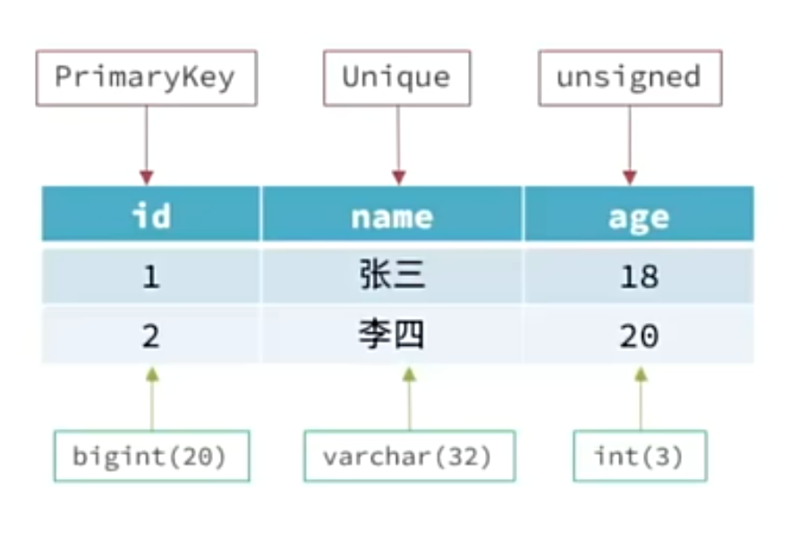
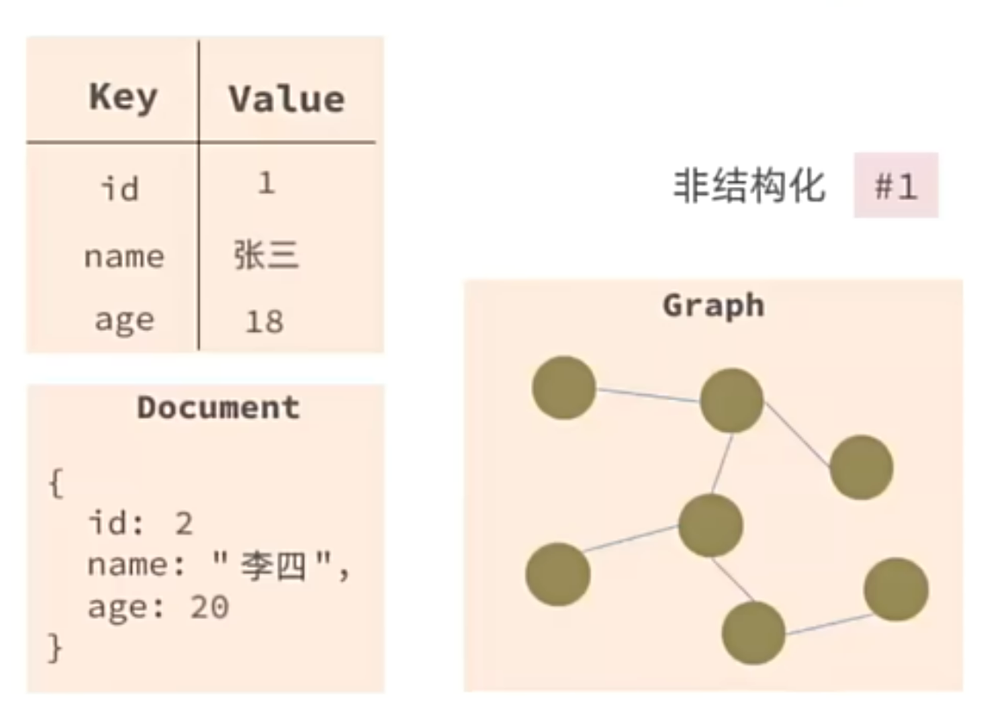
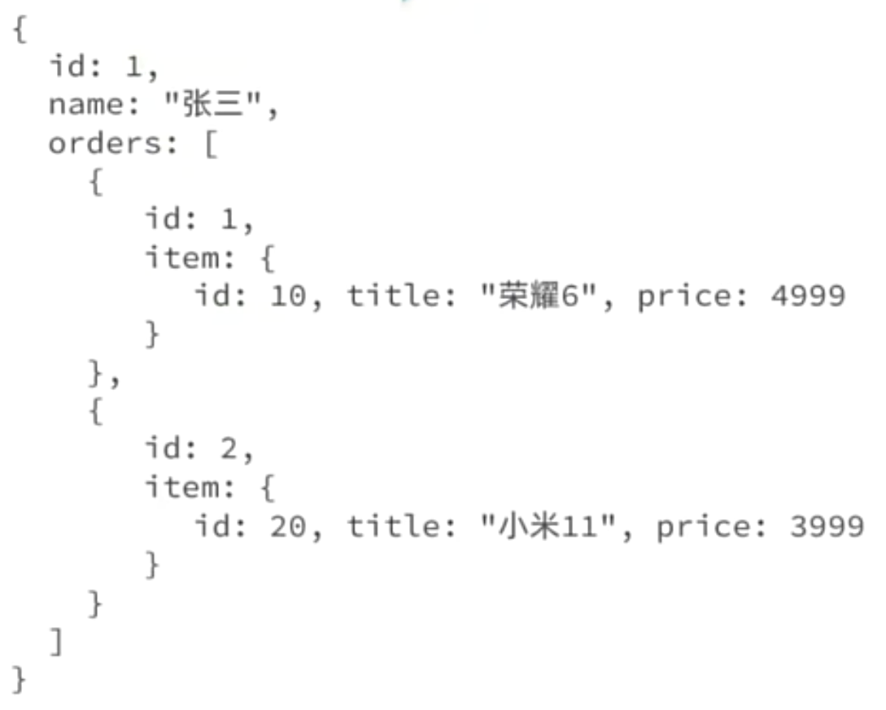
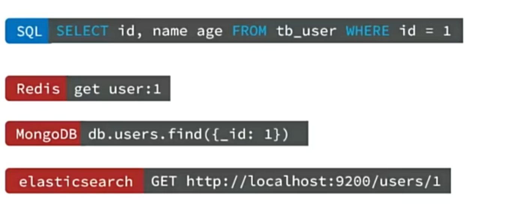
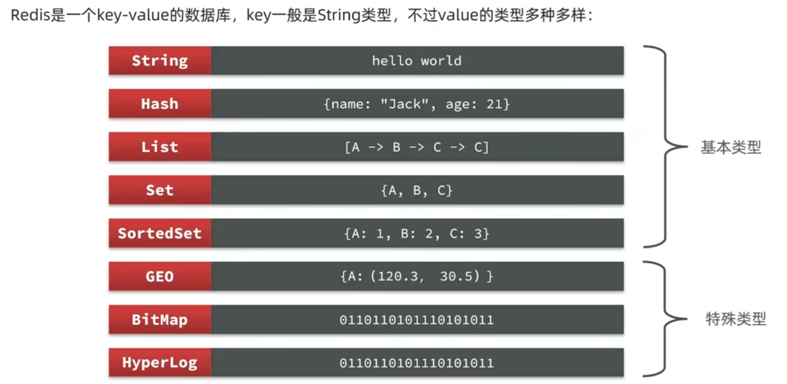

# Redis

Redis是一种键值型的数据库 —— NoSQL。

## 初识Redis

### 认识 NoSQL

- SQL —— 关系型数据库
  - S —— Structured，存入SQL的数据都是结构化的数据，要有一定的格式要求。一般要在创建时就确定好表的各种约束（结构），因为一旦开始使用就不便修改。当表在使用中并达到了一定数据量的规模，一个字段的修改就可能造成很大影响，并且表的变化可能导致业务也需要修改，非常麻烦。
  
  - 关系型，主要体现在外键，数据库会维护这些外键关系，因为只需要记录对应的主键作为字段值，不需要记录一整个元组，所以常常比较节省存储空间。
  
  - SQL查询(Structured Query Language结构化查询语句)，只要是关系型数据库，都可以用相同的语句进行查询。
  - ACID，原子性 (Atomicity)、 一致性(Consistency)、隔离性(Isolation) 和 持久性(Durability)。
  - 存储在磁盘，性能较低。
  - 垂直扩展性：数据存储在本机，影响性能的只有本机这台服务器的性能。MySQL的分布式只是主从关系，机器的数量增加了，宏观上提升了读写的速度，但主和从存储的数据是完全一致的，因此并没有提升数据的存储上限。
- NoSQL —— 非关系型数据库
  - NoS —— No Structure，非结构化，它对数据的结构没有这么严格的约束，例如Redis，就是一种键值型的NoSQL数据库，对Key和Value的类型都可以自定义。还有一种NoSQL是文档型的，其中的数据以JSON分隔，在SQL中的一行数据就对应一个JSON，每个JSON中的字段都可以是任意的。还有图类型的NoSQL，多用于社交APP，每一个对象都是一个结点，结点与结点之间以联系来连接，例如存储人的信息，人与人之间的联系就构成结点间的一条条边。另外还有一种列类型的NoSQL，如下图。
  
  
  - 非关系型，当需要记录二者的关系时，常常直接将对方的一整个JSON对象存入自己的JSON体中。如果也想实现SQL中类似的外键形式的关系，就需要程序员自己进行维护。例如下图中，也可以略去item中的id以外的属性值，但这就需要程序员自己维护另一个Document中手机型号的id不能重复。
  
  - 非SQL查询，没有固定的语法格式，不统一。
  
  - BASE
    - 1.基本可用（Basically Available）:
      NoSQL允许分布式系统中某些部分出现故障，那么系统的其余部分依然可用。它不会像ACID那样，在系统出现故障时，进行强制拒绝，NoSQL允许在这种情况下继续部分访问。
    - 2.软状态（Soft State）:
      NoSQL在数据处理过程中，允许该过程存在数据状态暂时不一致的情况。但经过纠错处理，最终会一致的。
    - 3.最终一致性（Eventually Consistent）：
      NoSQL的软状态允许数据处理过程的暂时不一致，但是最终处理结果将是一致的，说明 NoSQL 对数据处理过程可以有短暂的时间间隔，也允许分更细的步骤一个一个地处理，最好数据达到一致即可。这在互联网上进行分布式应用具有其明显的优势。
  - 存储在内存，性能较高。
  - 水平扩展性：NoSQL 在插入数据时往往会基于数据的id或唯一的标识做哈希运算，判断出该数据应该存储在哪一个结点上，从而实现数据量的拆分，提高了数据的存储上限，实现了水平的扩展。
- 因此 SQL 更适合数据结构稳定、相关业务对数据安全性、一致性要求较高的场景；NoSQL 更适合数据结构不稳定、对一致性、安全性要求不高、对性能有更大需求的场景。

## 认识Redis

Redis诞生于2009年，全称是**Re**mote **Di**ctionary **S**erver —— 远程词典服务器，是一个基于内存的键值型NoSQL数据库。

- 键值(key-value)型，value 支持多种不同数据结构，功能丰富
- 单线程，每个命令具备原子性
- 低延迟，速度快（基于内存、IO多路复用、良好的编码）
- 支持数据持久化
- 支持主从集群、分片集群
- 支持多语言客户端

[Redis命令查询官网](http://redis.io/commands)
或在Redis命令行中使用 `help @<group>` 命令查询对应的数据类型下的操作命令，如 `help @generic` 查询所有数据类型通用的命令，`help @String` 查询操作String类型的命令。

### 常用通用指令

KEYS：查看符合模板的所有key，效率较低不建议在生产环境使用。一旦在大量数据下使用，由于是单线程，很容易阻塞。
DEL：删除一个指定的key
EXISTS：判断key是否存在
EXPIRE：给一个key设置有效期，有效期到期时会自动删除
TTL：查看一个key的剩余有效期，-1为永久，-2为已删除

### String类型指令

String类型，也就是字符串类型，是Redis中最简单的存储类型。其value是字符串，不过根据字符串的格式不同，又可以分为3类:

- string: 普通字符串
- int: 整数类型，可以做自增、自减操作
- float: 浮点类型，可以做自增、自减操作

不论哪种格式，底层都以字节数组形式存储，只是编码方式会有所不同。例如，数值类型的字符串会直接转换成二进制的形式再作为字节去存储，这样一个字节就可以表示一个很大的数字，更节省空间；而普通字符串就只能在某一指定的编码规则下转换成对应的字节码进行存储，占用的空间更大。

举例说明：整数123与字符串123，整数123会转换成01111011，作为字节存储就是0x7B，一个字节就可以存下，而字符串123就要分别给1、2、3进行编码，假设使用UTF-8编码得到0x31、0x32、0x33，要三个字节才能存下。

字符串类型的最大空间不能超过512M。

string的常见命令有:

- SET : 添加或者修改已经存在的一个String类型的键值对
- GET : 根据key获取String类型的value
- MSET : 批量添加多个String类型的键值对
- MGET : 根据多个key获取多个String类型的value
- INCR : 让一个整型的key自增1
- INCRBY : 让一个整型的key自增并指定步长，并可指定步长为负。例如: incrby num -2 让num 所对应的值自减2
- INCRBYFLOAT : 让一个浮点类型的数字自增并指定步长
- SETNX : 添加一个String类型的键值对，前提是这个key不存在，否则不执行。也即，只新增，不修改。
- SETEX : 添加一个String类型的键值对，并且指定有效期
