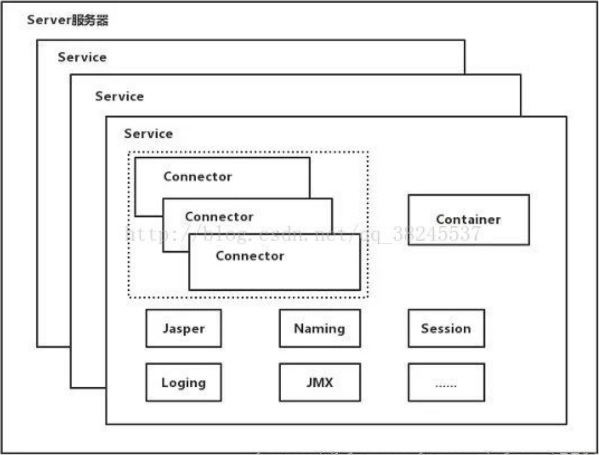
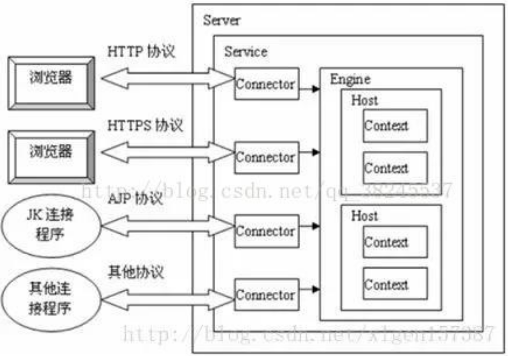

# Tomcat原理

Tomcat工作全流程详细如下：

1. 客户端请求
   - 客户端（如浏览器） 发起一个 HTTP 请求，输入一个 URL 或点击一个链接，如 `http://localhost:8080/myapp/hello`
   - DNS 解析 URL 将域名转换为服务器的 IP 地址。
   - TCP 连接 建立客户端与服务器之间的连接，通过 IP 地址和端口号（默认 8080）进行通信。

2. 服务器接收请求
   - Apache Tomcat 服务器 监听特定端口（如 8080），接收客户端发来的 HTTP 请求。
   - Tomcat 内的 Connector 组件解析请求的 HTTP 协议，并将请求封装成 HttpServletRequest 对象，同时创建 HttpServletResponse 对象。

3. 请求分发
   - Mapper 组件负责将请求的 URL **一步步** 映射到具体的 Context，然后再映射到具体的 Servlet 或 JSP，它决定了请求将由哪个 Web 应用的哪个资源来处理。下面的每一步都涉及 Mapper 对 URL 的解析，而不是一次性全部解析之后再逐级调用，是因为逐步解析的过程确保了每个层级都能正确地解析和映射 URL，并将请求路由到正确的位置。
   - 首先确定 Engine。Engine 是 Tomcat 的顶层容器组件，它管理多个虚拟主机（Host）。每个 Engine 只能有一个服务，并且一个服务中可以有多个虚拟主机。Connector 接收到请求后，Mapper 会找到其中的 Host 信息（例如，请求 `http://localhost:8080/myapp/hello` 中的 Host 就是 localhost），然后根据 Host 来匹配对应的 Engine。
   - Host 表示一个虚拟主机，它对应一个域名（如 localhost）。一个 Host 组件可以包含多个 Web 应用（Context）。不同的虚拟主机可以在同一个 Tomcat 实例中运行，允许一个 Tomcat 服务器托管多个网站。Host 组件接收到请求后，会根据请求的 Context Path 选择对应的 Context 组件。例如，请求 `http://localhost:8080/myapp/hello` 中的 Context Path 就是 /myapp。Host 使用 Mapper 组件根据请求的 Context Path 找到对应的 Context。
   - 然后确定 Context，Context 表示一个 Web 应用（如 /myapp）。Context 是 Tomcat 中最重要的组件，它负责管理 Web 应用的所有资源，包括 Servlet、JSP、静态文件（如 HTML、CSS、JS）等。每个 Web 应用都有一个唯一的 Context Path。Context 组件接收到请求后，Mapper 组件会根据请求的路径信息进一步解析，确定具体的资源（Servlet 或 JSP）。例如，请求 `http://localhost:8080/myapp/hello` 中的路径 /hello 就对应一个 Servlet HelloServlet。

4. Servlet 处理请求
   - Web 容器（Servlet 容器）负责加载、初始化和执行 Servlet。
   - Servlet 是一个 Java 类，它实现了 javax.servlet.Servlet 接口，用于处理 HTTP 请求和生成响应。
   - 一旦 Mapper 组件确定了请求的目标 Servlet，Tomcat 会调用 Servlet 容器加载并初始化这个 Servlet（如果尚未加载）。然后，调用 Servlet 的 service 方法（通常是 doGet 或 doPost 方法）来处理请求。
   - Servlet 的功能是处理请求并生成响应，将响应内容写入 HttpServletResponse 对象。Connector 组件将 HttpServletResponse 转换为 HTTP 响应报文，并通过网络发送回客户端。
   - Servlet 生命周期
        - 加载和实例化：当第一次请求 Servlet 时，Tomcat 加载 Servlet 类并创建实例。
        - 初始化：调用 init(ServletConfig config) 方法初始化 Servlet，只执行一次。
        - 请求处理：每次请求到达时，调用 service(HttpServletRequest request, HttpServletResponse response) 方法，实际处理请求的是 doGet 或 doPost 等方法。
        - 销毁：当服务器关闭或 Servlet 被卸载时，调用 destroy() 方法销毁 Servlet。

        ```java
        @WebServlet("/hello")
        public class HelloServlet extends HttpServlet {
            protected void doGet(HttpServletRequest request, HttpServletResponse response) throws ServletException, IOException {
                response.setContentType("text/html;charset=UTF-8");
                PrintWriter out = response.getWriter();
                out.println("<html><body>");
                out.println("<h1>Hello, World!</h1>");
                out.println("</body></html>");
            }
        }
        ```

    如果确定的资源是 JSP：
   - JSP（JavaServer Pages） 是一种用于生成动态网页的技术，本质上是一个带有特定标记和脚本的 HTML 页面。
   - JSP 转换和编译：第一次请求 JSP 时，Tomcat 会将 JSP 文件转换为 Servlet（Java 源代码），然后编译成字节码（.class 文件）。
   - Servlet 执行：JSP 编译后的 Servlet 按照 Servlet 的处理流程处理请求，生成响应。
   - 一旦 Mapper 组件确定了请求的目标 JSP 文件，Tomcat 会调用 JSP 容器来处理该请求。如果 JSP 文件尚未编译，Tomcat 会先将 JSP 文件转换为 Servlet 并进行编译。然后 Tomcat 再会调用生成的 Servlet 的 service 方法（通常是 doGet 或 doPost 方法）来处理请求。然后 JSP 文件中的 Java 代码被执行，生成动态内容，并将结果写入 HttpServletResponse 对象。Connector 组件将 HttpServletResponse 转换为 HTTP 响应报文，并通过网络发送回客户端。

   - hello.jsp 文件：

        ```jsp
        <%@ page contentType="text/html;charset=UTF-8" language="java" %>
        <html>
        <body>
            <h1>Hello, World!</h1>
        </body>
        </html>
        ```
        
        > Q: 可见，上面无论是JSP，还是servlet，最后返回的都是一个html页面。为什么前端会需要返回一个html页面呢，前端需要html不是应该自己写吗？
        >
        > A: 首先，在传统的Web应用开发框架中，前后端是不分离的，一个应用内既有请求处理、业务逻辑，也有前端的页面，客户端在请求时会接收到一整个（包含 CSS 的）HTML 页面，然后显示在客户端中。
        >
        > 但是在现代前后端分离架构中，常常不会选择这种做法。前端应用（通常使用框架如React、Angular或Vue）与后端应用会通过API进行通信，前端负责所有视图和交互逻辑，后端只提供数据和业务逻辑。在这种情况下，Servlet 返回的一般就是包含前端所需要的信息的 JSON 格式的数据。
   
5. 生成响应

   - Servlet 或 JSP 处理请求后，生成 HTML、JSON 或其他格式的响应内容，通过 HttpServletResponse 对象写入响应。
   - Connector 组件将响应转换为 HTTP 响应报文，发送回客户端。

6. 客户端接收响应
   - 浏览器 接收服务器返回的 HTTP 响应，解析响应内容（如 HTML），并呈现给用户。





